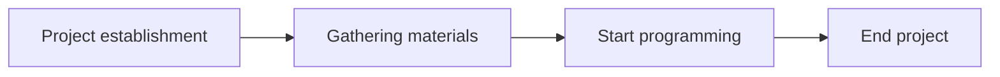

# Flappy Bird Online

> **Github repository**: https://github.com/NENU-A624/FlappyBirdOnline

 >
This project follows the MIT open-source licence. Permissions for including but not limited to commercial using, modification, distribution or just private using.

Flappy bird -- which game was once popular all over the world as a leisure type, also as the first development project for many game engineers, was a **single-player** game. In this project, we made efforts to make it available and play with one another **online**.

The game is very simple to play, as those traditional versions, you just need to click on the screen, and operate the bird to fly over, more fittingly, go through the pipes which appear from upper and lower edges of the screen to make a higher score. The difference is that this is not a single game, you can control your own birds and compete with other players, actually. But, you must ensure that your client(a real phone or virtual device) can connect to a server  device that deploys the server side of the project, otherwise the game will **never** start, just like the Genshin Impact!(Haha~, this is a little guilty treasure of developers. I believe you won't mind, right?)

## Members(In lexicographic order, name from Github):

- lbh123q

  > Email: 508278769@qq.com

  The author who major writes the Interaction between client and server. Completes the key technical issues.

  ------

- liujy660

  > Email: 3097086700@qq.com

  The main tester, who provides the running environment of the software and the server device(with STCloudLake).

  ------

- STCloudLake

  > Blog: http://192.3.158.26/

  > Email: stcloudlake@gmail.com or cloudlake@qq.com

  The proponent of project thought, as the major maintainer of this project, providing ideological and technical guidance, as well as this README file :)
  
  ------
  
  

## About project working progress

### 1.Draw View & Play Sound

It's very easy. There's nothing to say. Detailed notes have been made in the program, instead of here.

If you don't feel noisy, you can add the audio resource class reserved in the program by yourself.

But I prefer to be a silent bird:)

------

### 2.Connection Progress

------

### 3.Socket working progress

1. Server listening

   > The so-called server listening means that the server socket does not locate the specific client socket, but is in the state of waiting for connection, and monitors the network status in real time.

2. Client request

   > The so-called client request refers to the connection request made by the socket of the client, and the target to be connected is the socket of the server. For this reason, the socket of the client must first describe the socket of the server to which it is connected, point out the address and port number of the server socket, and then make a connection request to the server socket.

3. Connection confirmation

   > The so-called connection confirmation means that when the server socket hears or receives the connection request of the client socket, it will respond to the request of the client socket, establish a new thread, and send the description of the server socket to the client. Once the client confirms this description, the connection is established. The server-side socket continues to listen and receives connection requests from other client sockets .
   
   

## Develop and deploy project

1. Develop environment

   - Android Studio (Client & FlappyBirdOnline)
     - Android Gradle Plugin Version 7.0.4
     - Gradle Version 7.0.2
     - Compile Sdk Version 29
     - Min Sdk Version 21
     - Target Sdk Version 29
   - Intellij Idea (Socket Server)
     - Jdk-1.8.0_291 & Jdk-16
     - Sdk default 8
     - Maven 3
   
2. Deploy environment

   - Client

     - Android System Device (or virtual device), for API 29 above.
     
     - Google play service
     
   - Server

     - Windows 10/ Linux (best for centOS7)
	
     - Apache Tomcat Server 9.0.45 / Nginx 1.20.2

     - Docker 3.9

## Project develop progress

1. Project establishment 2022.4.5 
2. Gathering materials 2022.4
3. Start programming 2022.5
4. Client complete 2022.5.26
5. Server complete 2022.6.1
6. End project 2022.6.6

